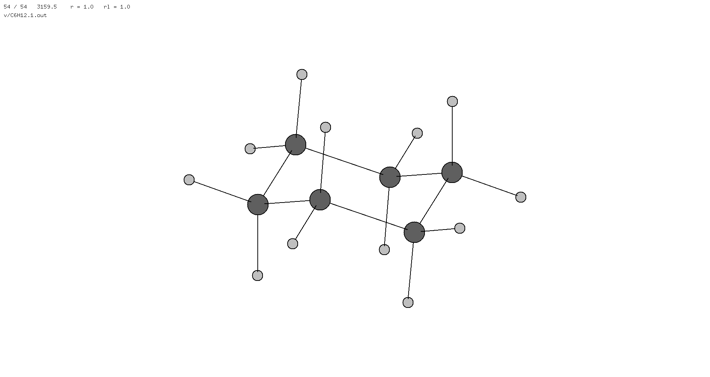

# gif-merge

This program makes and animated gif from gif images
without blowing up the RAM
using a "dirty hack" with separate color palettes.

## Compilation
```make```

## Usage
```
./gif [OPTIONS] INPUTFILE_1 [INPUTFILE_2 ... INPUTFILE_N] OUTFILE

Options:
  -d NUM    delay between frames in 1/100s, default 1
  -l        loop the animation
```

## Example
Animate one of C₆H₁₂'s vibrational modes:
```
./gif data/*.gif out.gif -l
```
The frames were produced with [`v`](https://github.com/briling/v)
and converted from `.xpm` to `.gif` with [`ImageMagick`](https://imagemagick.org/index.php).

